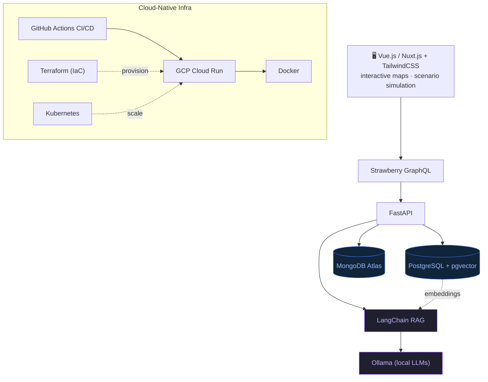

<!--  github.com/edxeme/edxeme  ·  profile README  ·  terminal aesthetic  -->

<h1 align="left">Edwin &ldquo;Ed&rdquo; Martinez</h1>

<p align="left">
  <a href="https://github.com/edxeme"></a>
</p>

<p align="left">
  <a href="https://www.linkedin.com/in/edxeme"></a>
  <a href="mailto:edxeme@gmail.com"></a>
  <a href="https://www.google.com/maps/place/Bogotá"></a>
  <a href="https://github.com/edxeme"></a>
  
</p>

---

```text
 ●  ●  ●        edxeme@github: ~
──────────────────────────────────────────────────────────────────────────
$ whoami
edxeme
$ uname -a
edxeme 5.0.0-dev "bricks→bytes" x86_64 GNU/Linux
```

## `$ export FOCUS="--ai-first"`

> Twenty years designing buildings, then bytes — the medium changed; the discipline (structure, systems, user impact) did not. I led AEC & ConTech ventures before pivoting into AI-enhanced, cloud-native SaaS, where I now ship **Vue/Nuxt**, **FastAPI/GraphQL**, **vector databases**, and **local LLM** pipelines with the same load-path rigor I once applied to concrete.

<p align="left">
  
  
  
  
</p>

---

## `$ ls skills`

**`frontend/`**
<p>
  
  
  
  
  
  
</p>

**`backend/`**
<p>
  
  
  
  
  
</p>

**`data--ai/`**
<p>
  
  
  
  
  
  
</p>

**`infra--devops/`**
<p>
  
  
  
  
  
</p>

**`aec--legacy/`**&nbsp;&nbsp;<sub>(14 yrs before the bytes era)</sub>
<p>
  
  
</p>

---

## `$ sysctl -a 2>/dev/null | grep edxeme.metrics`

```text
edxeme@contech-os:~$ sysctl -a 2>/dev/null | grep edxeme.metrics

  edxeme.metrics.efficiency_gain        +40%     # project evaluation (ConTech AI platform)
  edxeme.metrics.api_latency_reduction  -60%     # geospatial + financial GraphQL
  edxeme.metrics.active_users           500+     # platform users
  edxeme.metrics.rag_accuracy_gain      +35%     # regulation matching (LangChain + Ollama)
  edxeme.metrics.release_cycle_cut      -50%     # CI/CD automation (Cloud Run + Terraform)
  edxeme.metrics.infra_uptime           99.9%    # Toptal deployments (K8s + GitHub Actions)
  edxeme.metrics.client_rating          4.8/5    # Toptal client satisfaction
  edxeme.metrics.portfolio_managed      $5M+     # +15% ROI (Corfiamerica)
```

---

## `$ git log --oneline --career`

```text
edxeme@contech-os:~$ git log --oneline --career

2025  Revelo · AI Trainer for Coding (Python / LLM human data)
2025  In-house ConTech AI Platform · Lead Full-Stack & AI Engineer
2022  Toptal · Senior Full-Stack Developer · 15+ projects · 4.8/5
2021  Freelancer.com · Full-Stack Developer · 20+ SPAs · 95% sat.
2016  CONSTRUCTORA INCOAR · Founder & MD · teams of 30
2014  Corfiamerica · Project Manager · $5M+ portfolios
2006  AEC & Construction · 14 yrs (BIM · Lean · AutoCAD)
```

> _Education & certifications live on [LinkedIn](https://www.linkedin.com/in/edxeme) — BArch & M.Sc. Construction Management (Javeriana), B.Sc. Computer Science (in progress), SENA Software Dev, GCP / Python / Git / Docker certs._

---

## `$ docker compose config`

<sub># ConTech AI platform — reference architecture</sub>



---

## `$ fetch --activity`

<p align="center">
  <a href="https://github.com/edxeme">
    
  </a>
</p>

<p align="center">
  <picture>
    <source media="(prefers-color-scheme: dark)" srcset="https://raw.githubusercontent.com/edxeme/edxeme/output/github-contribution-grid-snake-dark.svg">
    <source media="(prefers-color-scheme: light)" srcset="https://raw.githubusercontent.com/edxeme/edxeme/output/github-contribution-grid-snake.svg">
    
  </picture>
</p>

> _Snake generated by the [`Platane/snk`](https://github.com/Platane/snk) GitHub Action on the `output` branch._

---

```text
edxeme@contech-os:~$ logout
# connection closed. keep shipping. 🧱▶💻
```

<p align="center">
  <sub>bytes &nbsp;·&nbsp; formerly bricks &nbsp;·&nbsp; <code>edxeme@github</code></sub>
</p>
