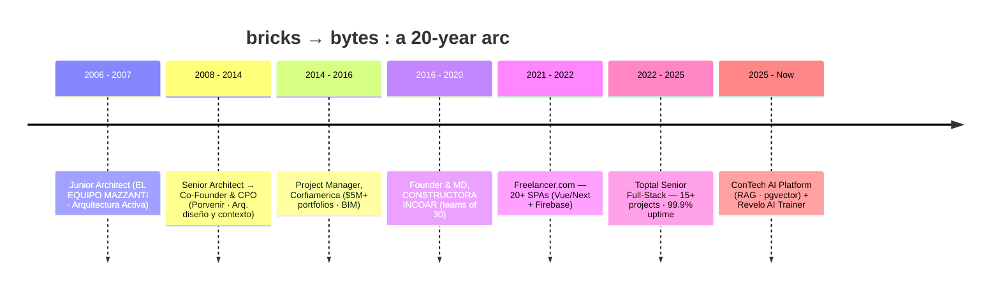
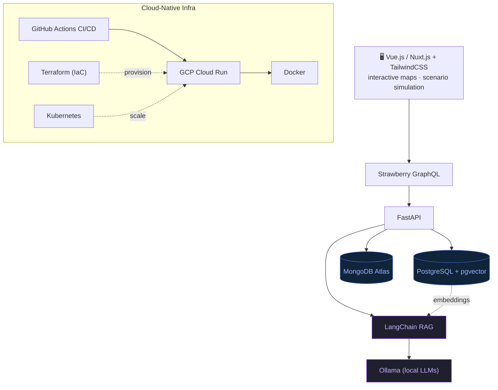

<!-- ────────────────────────────────────────────────────────────────────── -->
<!--  github.com/edxeme/edxeme  ·  profile README  ·  terminal aesthetic    -->
<!--  author: Ed Martinez (Edwin Martínez) · edxeme                         -->
<!-- ────────────────────────────────────────────────────────────────────── -->

```text
 ●  ●  ●        edxeme@github: ~
──────────────────────────────────────────────────────────────────────────
$ whoami
Edwin "Ed" Martínez
$ uname -a
edxeme 5.0.0-dev "bricks→bytes" Bogotá.CO x86_64 GNU/Linux
```

<h1 align="left">Ed Martinez&nbsp;&nbsp;<sub><code>edxeme@github:~$</code></sub></h1>

**Full-Stack Developer (bytes) & Architect (bricks)** — Bogotá, Colombia

<p align="left">
  <a href="https://github.com/edxeme"></a>
</p>

<p align="left">
  <a href="https://github.com/edxeme"></a>
  <a href="https://www.linkedin.com/in/edxeme"></a>
  <a href="mailto:edxeme@gmail.com"></a>
  <a href="https://edxeme.github.io"></a>
  <a href="https://www.google.com/maps/place/Bogotá"></a>
  
</p>

---

## `$ cat profile.yml`

```yaml
# edxeme@contech-os:~$ cat profile.yml
identity:
  name: "Edwin Martínez"
  brand: "Ed Martinez"            # personal brand / diminutive
  handle: "edxeme"
  role: "Full-Stack Developer (bytes) & Architect (bricks)"
  location: "Bogotá, Colombia"
  email: "edxeme@gmail.com"
  linkedin: "https://www.linkedin.com/in/edxeme"
  github: "https://github.com/edxeme"
  site: "https://edxeme.github.io"

languages:
  spanish: "Native / Bilingual"
  english: "Full Professional"

focus:
  primary: "LLMOps"
  secondary: ["AI", "RAG", "Vector Databases"]
  narrative: "architect (bricks) -> developer (bytes) -> AI engineer"

experience_years: 20
status: "building AI-enhanced, cloud-native SaaS"
```

---

## `$ export FOCUS="--ai-first"`

> **`# pivoting: architect (bricks) → developer (bytes) → AI engineer (LLMOps)`**
>
> Senior Full-Stack Developer with **20+ years** leading AEC & ConTech ventures, now building AI-enhanced, cloud-native SaaS. I design systems the way I once designed buildings — load paths, modularity, resilience — but the materials are now **Vue/Nuxt**, **FastAPI/GraphQL**, **vector databases**, and **local LLMs**.

<p align="left">
  
  
  
  
</p>

---

## `$ ls skills`

**`frontend/`**
<p>
  
  
  
  
  
  
</p>

**`backend/`**
<p>
  
  
  
  
  
</p>

**`data--ai/`**
<p>
  
  
  
  
  
  
</p>

**`infra--devops/`**
<p>
  
  
  
  
  
</p>

**`aec--legacy/`**&nbsp;&nbsp;<sub>(14 yrs before the bytes era)</sub>
<p>
  
  
</p>

---

## `$ neofetch`

```text
edxeme@contech-os:~$ neofetch

        ╔══════════════════════════════════╗
        ║   🧱 bricks   ──▶   💻 bytes     ║
        ╚══════════════════════════════════╝

  user      :  edxeme (Ed Martinez)
  os        :  AI-enhanced SaaS
  kernel    :  FastAPI + Strawberry GraphQL
  shell     :  Vue/Nuxt + TailwindCSS
  uptime    :  20+ yrs building (bricks → bytes)
  location  :  Bogotá, Colombia
```

## `$ sysctl -a 2>/dev/null | grep edxeme.metrics`

```text
edxeme@contech-os:~$ sysctl -a 2>/dev/null | grep edxeme.metrics

  edxeme.metrics.efficiency_gain        +40%     # project evaluation (ConTech AI platform)
  edxeme.metrics.api_latency_reduction  -60%     # geospatial + financial GraphQL
  edxeme.metrics.active_users           500+     # platform users
  edxeme.metrics.rag_accuracy_gain      +35%     # regulation matching (LangChain + Ollama)
  edxeme.metrics.release_cycle_cut      -50%     # CI/CD automation (Cloud Run + Terraform)
  edxeme.metrics.infra_uptime           99.9%    # Toptal deployments (K8s + GitHub Actions)
  edxeme.metrics.client_rating          4.8/5    # Toptal client satisfaction
  edxeme.metrics.toptal_projects        15+      # full-stack apps delivered
  edxeme.metrics.portfolio_managed      $5M+     # +15% ROI (Corfiamerica)
  edxeme.metrics.peak_team_size         30       # construction crews (INCOAR)
```

---

## `$ git log --oneline --career`



---

## `$ cat experience.log`

### `[2025-07 → now]` Revelo — **AI Trainer for Coding**
Training & fine-tuning AI coding models by reviewing/improving AI-generated **Python**; writing TDD unit tests and reference solutions that produce high-quality human data for LLMs.

### `[2025-01 → now]` In-house ConTech AI Platform — **Lead Full-Stack Developer & AI Engineer** · Colombia
AI-powered SaaS for real-estate & regulatory feasibility — **Vue/Nuxt** + **FastAPI/Strawberry GraphQL** + **MongoDB/pgvector** + **LangChain/Ollama** RAG → **+40%** evaluation efficiency, **500+** users, **−60%** API latency, **+35%** accuracy; shipped on **GCP Cloud Run + Terraform** CI/CD → **−50%** release cycles.

### `[2022-09 → 2025-01]` (2y5m) Toptal — **Senior Full-Stack Developer**
**15+** full-stack apps (Vue/Tailwind/Nest) with REST/GraphQL APIs → **−45%** DB latency; GCP deploys via Docker/K8s/GitHub Actions → **99.9%** uptime, **−70%** deploy time; **4.8/5** across cross-timezone teams.

### `[2021-01 → 2022-08]` (1y8m) Freelancer.com — **Full-Stack Developer**
**20+** Vue/Next + Firebase SPAs (**95%** satisfaction); CI/CD + SSR → **+40%** load times.

<details>
<summary><b>↪ <code>$ tail experience.log</code> &nbsp; <i># the bricks era (2006–2020)</i></b></summary>

- `[2016-08 → 2020-12]` **Founder & MD**, CONSTRUCTORA INCOAR (Bogotá) — led teams of **30**; Lean Construction + custom tracking software → **+25%** allocation, **−15%** delivery; pivoted toward ConTech.
- `[2014-12 → 2016-06]` **Project Manager**, Corfiamerica (Bogotá) — predictive models over **$5M+** portfolios (**+15% ROI**); Lean + BIM → **−30%** delivery, **−20%** approval times.
- `[2009-02 → 2014-11]` **Co-Founder & CPO**, Arquitectura diseño y contexto (Bogotá) — BIM + AutoCAD scripting → **−25%** blueprint delivery.
- `[2008-01 → 2009-01]` **Senior Architect**, Porvenir (Bogotá) — Excel maintenance tracking (**+25%** efficiency).
- `[2007-02 → 2007-12]` **Junior Architect**, Arquitectura Activa (Bogotá) — POS/commercial layouts in AutoCAD.
- `[2006-01 → 2007-01]` **Junior Architect**, EL EQUIPO MAZZANTI (Bogotá) — 3D renderings for award-winning competitions.

</details>

---

## `$ docker compose config`&nbsp;&nbsp;<sub># ConTech AI platform — reference architecture</sub>



---

## `$ fetch --stats`

<p align="center">
  <a href="https://github.com/edxeme">
    
  </a>
  <a href="https://github.com/edxeme">
    
  </a>
  <br>
  <a href="https://github.com/edxeme">
    
  </a>
</p>

---

## `$ activity-graph --render`

<p align="center">
  <a href="https://github.com/edxeme">
    
  </a>
</p>

---

## `$ ./snake.sh --animate contributions`

<p align="center">
  <picture>
    <source media="(prefers-color-scheme: dark)" srcset="https://raw.githubusercontent.com/edxeme/edxeme/output/github-contribution-grid-snake-dark.svg">
    <source media="(prefers-color-scheme: light)" srcset="https://raw.githubusercontent.com/edxeme/edxeme/output/github-contribution-grid-snake.svg">
    
  </picture>
</p>

> _The snake is generated by the [`Platane/snk`](https://github.com/Platane/snk) GitHub Action and committed to the `output` branch as `github-contribution-grid-snake.svg` (+ a `-dark` variant). It animates automatically on a daily cron._

---

## `$ cat education.log`

```text
edxeme@contech-os:~$ cat education.log

[2025-01 → 2026-06]  Pontificia Universidad Javeriana        Bachelor of Engineering, Computer Science
[2023-11 → 2025-02]  SENA                                   Associate's degree, Software Development
[2020-12 → 2021-12]  Universidad Pontificia Bolivariana      Technical Certificate, Web Development
[2008-07 → 2010-03]  Pontificia Universidad Javeriana        Master's, Construction Management
[1999-01 → 2005-09]  Pontificia Universidad Javeriana        Bachelor of Architecture (BArch)
```

---

## `$ ls -1 /etc/certs`

```text
edxeme@contech-os:~$ ls -1 /etc/certs

  ✔ Web Development
  ✔ Developing Applications with Google Cloud Specialization
  ✔ Exploratory Data Analysis in Python
  ✔ Git and GitHub
  ✔ Deploying Applications and Services in Docker Containers
```

---

## `$ echo $CONTACT`

```bash
edxeme@contech-os:~$ echo $CONTACT

  # Site
  curl -sL https://edxeme.github.io

  # LinkedIn
  curl -sL https://www.linkedin.com/in/edxeme

  # Email
  mail -s "let's build something" edxeme@gmail.com

  # Code
  git clone git@github.com:edxeme/edxeme.git
```

<p align="left">
  <a href="https://edxeme.github.io"></a>
  <a href="https://www.linkedin.com/in/edxeme"></a>
  <a href="mailto:edxeme@gmail.com"></a>
  <a href="https://github.com/edxeme"></a>
</p>

---

```text
edxeme@contech-os:~$ logout
# connection closed. thanks for reading — keep shipping. 🧱▶💻
```

<p align="center">
  <sub>Ed Martinez · bytes &nbsp;·&nbsp; formerly bricks &nbsp;·&nbsp; <code>edxeme@github</code></sub>
</p>
